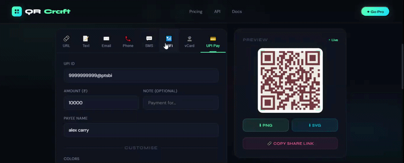

# 🚀 QRCraft — Dynamic QR Code Generator

> Generate **beautiful, customizable QR codes instantly** — no signup, no backend, 100% client-side.

---

## ✨ Overview

**QRCraft** is a modern, responsive QR Code Generator built using pure HTML, CSS, and JavaScript.
It allows users to create **high-quality, customizable QR codes** for multiple use cases with real-time preview and instant downloads.

---

## 📸 Preview




------------
## 🔥 Features

* ⚡ **Instant QR Generation** (real-time preview)
* 🎨 **Full Customization** (colors, size, styles)
* 🧩 **Multiple QR Types**:

  * URL
  * Text
  * Email
  * Phone
  * SMS
  * WiFi
  * vCard (Contact)
  * UPI Payments 💳
* 🖼️ **Logo Upload Support** (center branding)
* 📐 **High-Quality Export**

  * PNG
  * SVG (vector format)
* 🔒 **Privacy First**

  * 100% client-side
  * No data sent to servers
* 📱 **Fully Responsive Design** (mobile, tablet, desktop)

---

## 🛠️ Tech Stack

* HTML5
* CSS3 (Modern UI + Animations)
* JavaScript (Vanilla JS)
* QRCode.js Library

---

## 📂 Project Structure

```
📁 dynamic-qr-generator
 ├── qr.html
 └── README.md
```

---
## ⚙️ Run Locally

Clone the repository:

```bash
git clone https://github.com/your-username/dynamic-qr-generator.git
cd dynamic-qr-generator
```

Open the project:

* Double-click `qr.html`
  **or**
* Open it in your browser

---

## 💡 Use Cases

* Business cards (vCard QR)
* Payments (UPI QR)
* Website sharing
* WiFi sharing
* Marketing campaigns
* Personal branding

---

## 🧠 Future Improvements

* QR analytics tracking
* Custom QR styles (dots, rounded)
* Dark/light theme toggle
* Backend for saved QR codes
* Short link integration

---

## 🤝 Contributing

Pull requests are welcome!
For major changes, please open an issue first.

---

## ⭐ Support

If you like this project:
👉 Give it a ⭐ on GitHub
👉 Share with others

---

## 📜 License


Copyright © 2026 - Apoorv Dwivedi

Licensed under the Apache License, Version 2.0 (the "License");
you may not use this file except in compliance with the License.
You may obtain a copy of the License at

   http://www.apache.org/licenses/LICENSE-2.0

Unless required by applicable law or agreed to in writing, software
distributed under the License is distributed on an "AS IS" BASIS,
WITHOUT WARRANTIES OR CONDITIONS OF ANY KIND, either express or implied.
See the License for the specific language governing permissions and
limitations under the License.

---
